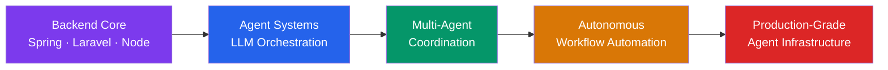

<div align="center">

<!-- Animated banner -->


<div id="header" align="center">
  
</div>

<!-- Animated typing -->
[](https://git.io/typing-svg)

<br/>

[](https://discord.gg/985865458622279750)
[](https://linkedin.com/in/stepanus-janu-b54618241)

</div>

---

## 🧠 About Me

Hey there! 👋 I'm **Stepanus Janu Adi Nugroho** — a **Backend Engineering undergraduate** at **Multi Data Palembang University**, deeply passionate about building intelligent, automated, and scalable systems.

My current research focus is **Automation Agent Systems** — designing multi-agent architectures that can reason, orchestrate tasks, and collaborate across distributed pipelines. I'm especially fascinated by the intersection of **AI engineering**, **backend infrastructure**, and **autonomous decision-making systems**.

> *"The best systems are the ones that build themselves."*

- 🔭 **Currently researching:** Autonomous agent frameworks, LLM-powered orchestration, and workflow automation
- 🌱 **Learning:** Agent memory architectures, tool-use patterns, ReAct & multi-agent coordination
- 💡 **Passionate about:** Simplifying complexity for mid-level engineers through clean system design
- 🎯 **Goal:** Building automation pipelines that reduce cognitive overhead in engineering workflows

---

## 🤖 Research Focus: Automation Agent Systems

> My current deep-dive — designing systems where software agents *think, plan, and act* autonomously.

```
┌─────────────────────────────────────────────────┐
│           AUTOMATION AGENT ARCHITECTURE          │
│                                                  │
│  [Planner Agent] ──→ [Tool-Use Agent]            │
│        │                    │                    │
│        ↓                    ↓                    │
│  [Memory Store]    [Execution Runtime]           │
│        │                    │                    │
│        └─────────┬──────────┘                    │
│                  ↓                               │
│         [Validator / Reflector]                  │
│                  │                               │
│                  ↓                               │
│            Final Output ✅                        │
└─────────────────────────────────────────────────┘
```

**Key areas of interest:**
- 🧩 **Multi-Agent Orchestration** — Coordinating specialized agents (Recon, Planner, Executor, Validator)
- 🔗 **LLM Tool-Use & Function Calling** — Binding language models to real APIs, databases, and compute
- 🗃️ **Agent Memory Systems** — Short-term context, long-term vector stores, episodic memory
- ⚡ **Workflow Automation** — Replacing manual engineering pipelines with self-driving task graphs
- 🛡️ **Reliability Engineering for Agents** — Fault-tolerance, retry logic, output validation loops

---

## 🎬 Animation & Visualization Passion

Beyond backend systems, I'm captivated by **technical animation as a communication tool** — using motion to explain complex architecture to mid-level engineers at a glance.

Tools & approaches I explore:
- **Mermaid.js** — Live diagram-as-code for system flows
- **Lottie / Rive** — Lightweight animation for technical dashboards
- **D3.js** — Data-driven visual storytelling for system metrics
- **CSS/SVG animation** — Micro-interactions that make UIs feel alive

> *My philosophy: if a system is hard to explain in text, animate it.*

---

## 💻 Tech Stack

### Languages


### Backend & Frameworks


### Frontend


### Databases


### Cloud & DevOps


### AI / ML


---

## 📊 GitHub Stats

<div align="center">

<!-- GitHub Stats — pakai instance khusus Asia yang lebih stabil -->

&nbsp;


<br/><br/>

<!-- Streak — demolab adalah yang paling stabil saat ini -->


<br/><br/>

<!-- Activity Graph — alternatif visual yang menarik & reliable -->


</div>

---

## 🗺️ Engineering Roadmap (Current)



---

## ✍️ Dev Philosophy

> *"Complexity is the enemy of reliability. Automate the repetitive, architect the essential."*

I build for **middle engineers** — systems and tools that are powerful enough to handle real-world scale, but clear enough that you don't need a PhD to maintain them. Good architecture tells its own story.

---

<div align="center">

<!-- komarev: paling stabil untuk profile views, tidak pernah down -->


</div>
