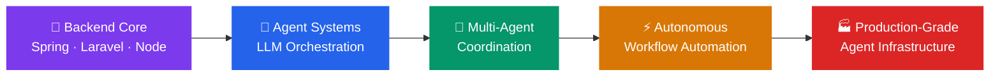

<div align="center">

[](https://git.io/typing-svg)

<br/>

[](https://discord.gg/985865458622279750)
[](https://linkedin.com/in/stepanus-janu-b54618241)
[](https://github.com/stepanusjanu19)

</div>

---

## 🧠 About Me

Hey there! 👋 I'm **Stepanus Janu Adi Nugroho** — a **Backend Engineering undergraduate** at **Multi Data Palembang University**, deeply passionate about building intelligent, automated, and scalable systems.

My current research focus is **Automation Agent Systems** — designing multi-agent architectures that can reason, orchestrate tasks, and collaborate across distributed pipelines. I'm especially fascinated by the intersection of **AI engineering**, **backend infrastructure**, and **autonomous decision-making systems**.

> *"The best systems are the ones that build themselves."*

- 🔭 **Currently researching:** Autonomous agent frameworks, LLM-powered orchestration, and workflow automation
- 🌱 **Learning:** Agent memory architectures, tool-use patterns, ReAct & multi-agent coordination
- 💡 **Passionate about:** Simplifying complexity for mid-level engineers through clean design & animation
- 🎯 **Goal:** Building automation pipelines that reduce cognitive overhead in engineering workflows
- 📍 **Based in:** Palembang, Indonesia

---

## 🤖 Research Focus: Automation Agent Systems

> Designing systems where software agents *think, plan, and act* autonomously.

```
┌──────────────────────────────────────────────────────┐
│            AUTOMATION AGENT ARCHITECTURE             │
│                                                      │
│   Input ──→ [Planner Agent] ──→ [Tool-Use Agent]     │
│                   │                    │             │
│                   ↓                    ↓             │
│            [Memory Store]   [Execution Runtime]      │
│                   │                    │             │
│                   └──────────┬─────────┘             │
│                              ↓                       │
│                  [Validator / Reflector]              │
│                              │                       │
│                              ↓                       │
│                       Final Output ✅                 │
└──────────────────────────────────────────────────────┘
```

| Area | Description |
|------|-------------|
| 🧩 **Multi-Agent Orchestration** | Coordinating specialized agents: Recon → Planner → Executor → Validator |
| 🔗 **LLM Tool-Use & Function Calling** | Binding language models to real APIs, databases, and compute |
| 🗃️ **Agent Memory Systems** | Short-term context, long-term vector stores, episodic memory |
| ⚡ **Workflow Automation** | Replacing manual pipelines with self-driving task graphs |
| 🛡️ **Reliability Engineering** | Fault-tolerance, retry logic, output validation loops |

---

## 🎬 Animation & Visualization for Engineers

Beyond backend systems, I use **technical animation as a communication tool** — motion that explains complex architecture to mid-level engineers at a glance.

> *"If a system is hard to explain in text, animate it."*

| Tool | Use Case |
|------|----------|
| **Mermaid.js** | Live diagram-as-code for system flows |
| **Lottie / Rive** | Lightweight animation for technical dashboards |
| **D3.js** | Data-driven visual storytelling for metrics |
| **CSS / SVG Animation** | Micro-interactions that make architecture feel alive |

---

## 💻 Tech Stack

### 🗣️ Languages


### ⚙️ Backend & Frameworks


### 🎨 Frontend


### 🗄️ Databases


### ☁️ Cloud & DevOps


### 🤖 AI / ML


---

## 📊 GitHub Stats

<div align="center">


<br/><br/>


<br/><br/>


</div>

---

## 🗺️ Engineering Roadmap



---

## ✍️ Dev Philosophy

> *"Complexity is the enemy of reliability. Automate the repetitive, architect the essential."*

I build for **middle engineers** — systems powerful enough for real-world scale, but clear enough that you don't need a PhD to maintain them. Good architecture tells its own story.

---

<div align="center">

[](https://visitcount.itsvg.in)


</div>
